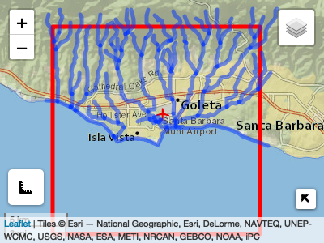

<!-- README.md is generated from README.Rmd. Please edit that file -->

``` r


AOI = aoi_get(list("UCSB", 10, 10)) 
nhd = HydroData::findNHD(AOI)
#> Returned object contains: 102 nhd flowlines

aoi_map(AOI, returnMap = T) %>% addPolylines(data = nhd$nhd)
#> Warning: sf layer has inconsistent datum (+proj=longlat +ellps=GRS80 +towgs84=0.0,0.0,0.0,0.0,0.0,0.0,0.0 +no_defs).
#> Need '+proj=longlat +datum=WGS84'
```



\`\`\`

# SRCgeneration

# Identify pt AOI

# Identify NHD via HydroData

# Extract HUC6

# Downlaod HUC6 HAND Data

# Download USGS rating curve / correct

# Build SRC
